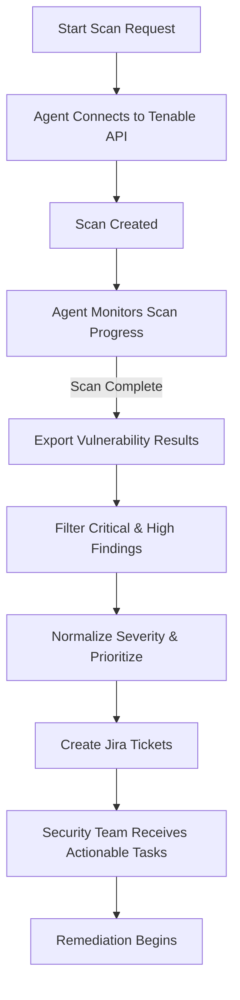

# Agentic AI Security Automation  
### Tenable → Jira Vulnerability Workflow Prototype

---

## Overview
This project demonstrates how an automated security agent can reduce manual effort in vulnerability management by connecting scan results directly to remediation workflows.

The prototype automatically:
- Launches vulnerability scans
- Monitors scan progress
- Filters high-priority findings
- Creates structured Jira tickets for remediation

The goal is simple: **reduce response time, eliminate manual triage, and ensure critical issues are never missed.**

---
## 🎥 Click Below to Watch the Demo Video ⬇️

## The Problem This Solves
Security teams often spend hours:
- Monitoring scan progress
- Sorting through findings
- Determining priority
- Manually creating tickets

This manual workflow introduces delays, inconsistency, and human error. As environments scale, this becomes increasingly inefficient.

This prototype shows how automation can streamline that entire process.

---

## How the System Works
The automation follows a simple but powerful workflow:

### 1. Scan Initiation
The agent connects to Tenable via API and provisions a scan for a target asset.

### 2. Autonomous Monitoring
Instead of requiring human supervision, the agent:
- Tracks scan progress
- Handles delays or long-running jobs
- Waits efficiently until completion

### 3. Intelligent Filtering
Once results are available, the system:
- Focuses only on high-impact vulnerabilities
- Maps technical severity data into operational priorities
- Removes low-value noise

### 4. Automated Ticket Creation
For each critical finding, the agent:
- Generates a Jira issue
- Includes relevant details and remediation guidance
- Ensures nothing is overlooked

---

## Key Capabilities Demonstrated
- API integration across multiple platforms
- Automated workflow orchestration
- Risk-based prioritization
- Reliable handling of asynchronous processes
- Reduction of manual triage workload

---

## Technologies Used
- Python
- Tenable.io API
- Jira Cloud API
- REST integrations
- Data normalization and prioritization logic

---

## Impact for Security Teams
This prototype illustrates how automation can:
- Reduce time spent on repetitive tasks
- Improve response speed to critical vulnerabilities
- Standardize prioritization decisions
- Support scalable security operations

---

## Why This Matters
In cybersecurity, delays increase risk. Automating the transition from detection to remediation allows organizations to respond faster and more consistently.

This project highlights how intelligent automation can serve as a force multiplier for security teams.

---

## Project Focus
This repository is designed to showcase:
- Problem-solving in real-world security workflows
- API integration skills
- Automation strategy
- Risk-based decision logic
- Practical application of agent-driven processes

---

## Visual Workflow Diagram

## Summary

This project demonstrates how agent-driven automation can improve vulnerability management by reducing manual workload, accelerating response times, and ensuring consistent prioritization of critical risks.
